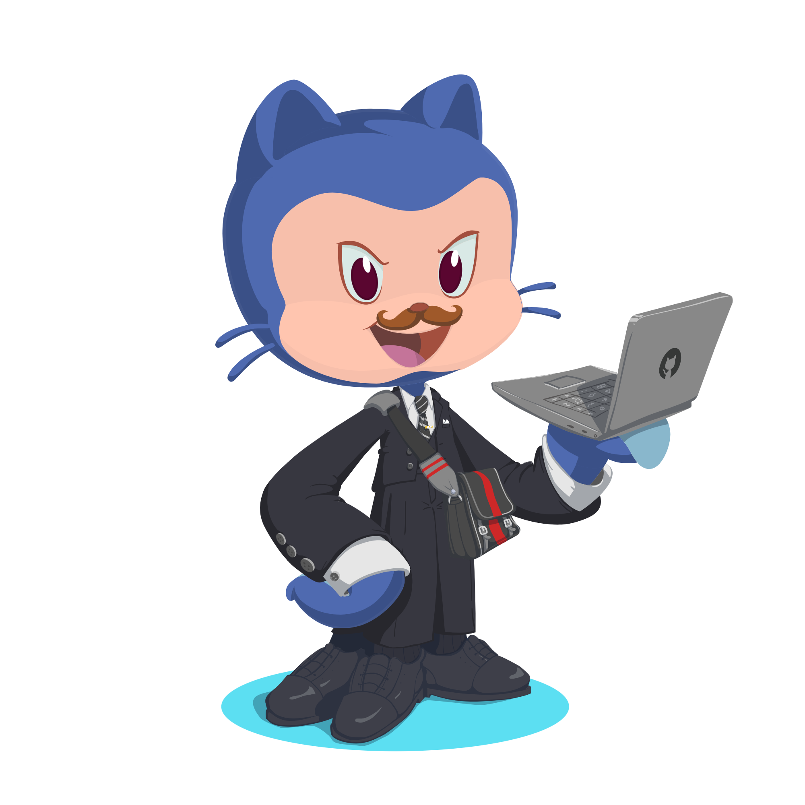

<h1 align="center">Hi, I'm Mark Christianiel Manalo </h1>

  <strong>Software Developer in Progress</strong> · Building practical systems and thoughtful interfaces

<table>
  <tr>
    <td width="42%" valign="middle" align="center">
      
    </td>
    <td width="58%" valign="middle">
      <h2>About me</h2>
      

        I’m <strong>Mark</strong>, an aspiring software developer focused on building useful,
        reliable applications with clear and considered user experiences.
      

      <ul>
        <li>🔭 Currently building a <strong>Online 3D Customization and Ordering System</strong>.</li>
        <li>🌱 Learning how to design and build <strong>Web APIs</strong>
        <li>🎨 Interested in <strong>system design</strong>, clean architecture, and UI/UX.</li>
        <li>🧩 Enjoy turning real-world workflows into simple, maintainable software.</li>
      </ul>
    </td>
  </tr>
</table>

## Tech I use

  
  
  
  
  
  
  
  
  
  
  
  
  
  
  
  
  
  
  
  
  
  

  <i>Open to learning, collaboration, and opportunities to build useful software.</i>

